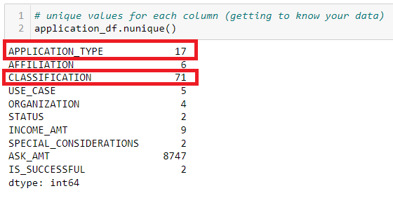
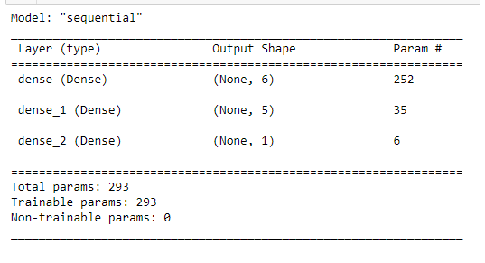

# Neural_Network_Charity_Analysis

### Purpose: 
Alphabet Soup wants to know when their donations to charities will be most successful.  By creating a binary classifier we are hoping to be able to help Alphabet Soup know exactly what works and what doesn't work in the world of Charity.

### Proceedure: 
The first thing needing to be accomplished was the preprocessing of the data for our deep neural network model.
To do so, we:

- determined columns that were features, targets and throw-aways
- removed the 'throw-away columns
- checked the number of unique values left for each column
  

- get application type and classification columns bucketed
- generate the categorical variable list

- encoding with OneHotEncoder
- replace the original columns with OneHotEncoders encoded features
- train, fit/test and scale the data

Next, we compile, train and evaluate the deep neural network model. Here's the summary of the model setup:

After that, we compile and after evaluating the module we can see it is not performing very well. 

We need to get better performance if at all possible. We attempt to do so by working with TensorFlow to optimize the model in order to achieve a target predictive accuracy higher than 75%. 

The following can be attempted to optimize a model to achieve a higher target predictive accuracy:

- Adjusting the input data to ensure that there are no variables or outliers that are causing confusion in the model, such as:
- Dropping more or fewer columns.
- Creating more bins for rare occurrences in columns.
- Increasing or decreasing the number of values for each bin.
- Adding more neurons to a hidden layer.
- Adding more hidden layers.
- Using different activation functions for the hidden layers.
- Adding or reducing the number of epochs to the training regimen.
    
### Results (3 attemps completed): 

#### Attempt 1: Dropping of columns. 

After training the model, we find that there aren't any differences. We are still at 72%.

#### Attempt #2 - Do both adding more hidden layers and dropping columns)

After training the model, we find that there aren't any differences. We are still at 72%.

After training the model, we find that there aren't any differences. We are still at 72%.

In conclusion, we are getting 72% after these three attempts. I is my guess at this point that accuracy cannot be increased with this model. Using a different model may prove to be a more useful way to spend my time.

Here are some of the regression modules I might try:
- Linear Regression.
- Ridge Regression. (Thumbs up on this model. Below is a description.)
- Neural Network Regression.
- Lasso Regression - works with Multicollinearity.
- Decision Tree Regression. (After evaluating the dataset. I could see there wasn't much change in the dataset. This might work, too.)
- Random Forest.
- KNN Model. (maybe...I don't know. I would have to investigate more before desiding.)
- Support Vector Machines (SVM) - Stocks

Out of these Ridge Regression sounds promising. It is another popularly used linear regression algorithm in Machine Learning. If only one independent variable is being used to predict the output, it will be termed as a linear regression ML algorithm. ML experts prefer Ridge regression as it minimizes the loss encountered in linear regression (discussed above). In place of OLS (Ordinary Least Squares), the output values are predicted by a ridge estimator in ridge regression. The above-discussed linear regression uses OLS to predict the output values.

It also may be smart to plot some of these (since they are linear models).

Resource: https://www.jigsawacademy.com/popular-regression-algorithms-ml/